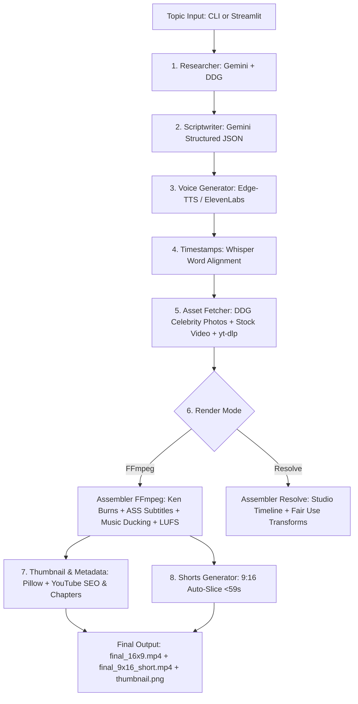

# GhostDirector — Master Architecture Blueprint & Handover Specification

> **Purpose**: This document provides a complete, self-contained architectural blueprint, code map, execution lifecycle, and optimization roadmap for GhostDirector. Any AI engineer or advanced model reading this document will have the complete context needed to audit, inspect, and elevate the system to broadcast-grade quality.

---

## 1. Executive Summary & Tech Stack

**GhostDirector** is an automated, faceless YouTube video generation engine built in Python. It produces both long-form 16:9 documentary videos (3–10 minutes) and 9:16 vertical Shorts (<59s) from a single topic prompt.

### Core Stack
* **Language & Runtime**: Python 3.14 on Windows (x64)
* **Hardware Profile**: NVIDIA GeForce MX450 (2GB VRAM) — requires CPU/lightweight GPU optimization
* **LLM Core**: Google Gemini API via `google-genai` SDK (`gemini-2.5-flash` / `gemini-1.5-flash`)
* **Voice Synthesis**: Microsoft Edge-TTS (`edge-tts`), ElevenLabs API (`httpx`), Google Translate TTS (`gTTS`)
* **Audio Alignment**: `whisper-timestamped` / OpenAI Whisper (`base` model)
* **Asset Fetching**: DuckDuckGo Image Search (`ddgs` / `duckduckgo-search`), Pexels API, Pixabay API, `yt-dlp`
* **Video Rendering Engine**: 
  * Primary: FFmpeg (`libx264`, `aac`, `ass`, `zoompan`, `loudnorm`)
  * Secondary / Professional: DaVinci Resolve Studio (via `DaVinciResolveScript` Python API)
* **Frontend**: Streamlit (`app.py`)

---

## 2. System Architecture & Pipeline Flow



---

## 3. Complete Codebase Map

The project root is located at: `c:\Users\frank\.gemini\antigravity\scratch\ghostdirector\`

| File | Lines | Primary Responsibility | Critical Methods / Notes |
| :--- | :--- | :--- | :--- |
| `main.py` | ~321 | CLI entrypoint, click arguments, pipeline orchestrator | `run_pipeline()`, batch processing, CLI banner |
| `config.py` | ~172 | Environment loading, directory paths, binary configs | `load_template()`, `_deep_merge()`, API keys |
| `models.py` | ~160 | Shared dataclasses across the entire system | `ResearchResult`, `Scene`, `Script`, `VideoProject`, `VisualType` |
| `app.py` | ~175 | Streamlit Web Studio UI | Live logging via `StreamlitLogHandler`, media player, preset selector |
| `requirements.txt` | ~35 | Python dependencies | Clean UTF-8, includes `google-genai`, `edge-tts`, `whisper-timestamped` |
| `.env` | ~7 | Secrets storage | `GEMINI_API_KEY`, `PEXELS_API_KEY`, `PIXABAY_API_KEY`, `ELEVENLABS_API_KEY` |
| **Pipeline Modules** | | | |
| `pipeline/researcher.py` | ~130 | Topic research & narrative discovery | Structured Gemini JSON output + markdown stripping + DDG fallback |
| `pipeline/scriptwriter.py` | ~410 | Humanized scriptwriting with visual directions | Anti-AI tone prompt, `SCRIPT_SCHEMA` enforcement, scene pacing |
| `pipeline/voice.py` | ~150 | Voiceover generation per scene | Cascading: ElevenLabs $\to$ Edge-TTS $\to$ gTTS; 44.1kHz duration check |
| `pipeline/timestamps.py` | ~190 | Word-level speech alignment | Runs `whisper-timestamped`, outputs word timing array per scene |
| `pipeline/assets.py` | ~465 | Scrapes & downloads real footage/photos | Dedup URL tracking, DDG unique celebrity photos, Pexels/Pixabay, `yt-dlp` |
| `pipeline/assembler_ffmpeg.py`| ~350 | Headless video assembly | Ken Burns, single-pass ASS subtitle + cinematic post-processing, LUFS |
| `pipeline/assembler_resolve.py`| ~215 | DaVinci Resolve Studio automation | Creates project, populates V1/V2/A1/A2 tracks, applies Fair Use transforms |
| `pipeline/thumbnail.py` | ~210 | High-CTR YouTube thumbnail generator | Face focus, half-gradient contrast, thick stroke text overlay |
| `pipeline/metadata.py` | ~135 | Title, description, tags & chapter markers | +3s hook rewind offset, tag length validation, YouTube compliance |
| `pipeline/uploader.py` | ~140 | YouTube Data API v3 uploader | OAuth flow, chunked resumable upload, automated thumbnail setter |
| `pipeline/shorts.py` | ~100 | 9:16 vertical short extractor | Clones script, finds climax scene sequence under 59s, 1080x1920 assemble |
| **Utils** | | | |
| `utils/ffmpeg_cmd.py` | ~295 | Subprocess wrappers for video/audio | `run_ffmpeg()`, `scale_and_crop()`, `photo_to_video()`, `normalize_audio()` |
| `utils/caption_renderer.py` | ~195 | ASS animated subtitle builder | Hormozi pop word-highlighting, ASS color hex conversion |
| `utils/retry.py` | ~70 | Exponential backoff decorator | Handles sync & async API network flakiness |
| `utils/logger.py` | ~55 | Unified Rich logger | Forces UTF-8 console output on Windows to prevent CP1252 crashes |

---

## 4. Data Contracts & Schemas

### 4.1. The Script & Scene Contract (`models.py`)
Every scene generated by `scriptwriter.py` adheres to this exact contract:
```python
@dataclass
class Scene:
    scene_number: int                          # 1-indexed
    narration: str                             # Conversational voiceover text (2-4 sentences)
    visual_prompt: str                         # Highly specific image/footage search query
    visual_type: str                           # "web_photo", "youtube_clip", "stock_video", "stock_photo"
    mood: str                                  # "dramatic", "suspenseful", "dark", "upbeat", etc.
    alternative_visual_prompts: list[str]      # Fallback queries
    people_to_show: list[str]                  # Full names of real people to visually feature
    duration_target_seconds: float = 8.0       # Target duration (typically 8-12s)

    # Populated dynamically by subsequent stages:
    audio_path: Optional[str] = None
    audio_duration_seconds: Optional[float] = None
    video_path: Optional[str] = None
    photo_path: Optional[str] = None
    timestamps: Optional[list[dict]] = None    # [{"word": str, "start": float, "end": float}]
```

### 4.2. Template Architecture (`templates/`)
Templates inherit from `templates/_base.json` via deep merge.
Key templates:
* `celebrity.json`: 18 scenes, 8 minutes, investigative documentary structure.
* `celebrity_4min.json`: 20 scenes, 4 minutes (~10–12s per scene for dynamic pacing).
* `documentary.json`: General historical / analytical documentary.
* `short_hook.json`: Fast-paced, high retention.

---

## 5. Summary of Solved Critical Bugs

Before any further modifications, note the following fixes already implemented in the code:
1. **Windows CP1252 Unicode Crash**: Resolved in `utils/logger.py` by forcing `sys.stdout` and `sys.stderr` to UTF-8 before Rich initialization.
2. **AAC Concat Buffer Overflow**: Fixed by enforcing `-c:a aac -b:a 192k -ar 44100 -ac 2` across all audio generators (`assembler_ffmpeg.py`, `ffmpeg_cmd.py`, hook rewind).
3. **Repeated Single Photo Bug**: Fixed in `pipeline/assets.py` via global `_used_urls` tracking and unique scene-specific DuckDuckGo image searches.
4. **Ken Burns Render Freeze (8000px)**: Reduced image pre-scale in `utils/ffmpeg_cmd.py` from 8000px to 3000px with `ultrafast` preset, reducing render time from 15 minutes to 3 seconds per scene.
5. **yt-dlp Execution on Windows**: Changed `cmd = ["yt-dlp", ...]` to `[sys.executable, "-m", "yt_dlp", ...]` in `pipeline/assets.py` to bypass Windows PATH resolution issues.
6. **Gemini Markdown Code Block Crashes**: Added markdown stripping in `pipeline/researcher.py` and `pipeline/scriptwriter.py` before deserializing JSON.
7. **Single-Pass Post-Processing**: Merged subtitle burning and cinematic filters (vignette/film grain) into a single FFmpeg filtergraph, cutting assembly time in half.
8. **Real Music Assets**: Downloaded full-length cinematic score into `assets/music/` to replace the 15-second placeholder.

---

## 6. Known Weaknesses & Optimization Roadmap (For the Next AI)

To transition GhostDirector from an automated prototype to a high-retention, broadcast-quality platform (similar to Vox, Magnates Media, or Lemmino), the following enhancements should be implemented:

### Priority 1: Multi-Cut Scene Layering (Visual Pacing)
* **Current Limitation**: Each scene (8–12 seconds) currently displays one continuous visual (one Ken Burns photo or one stock video).
* **Target Improvement**: Allow scenes to have **2 to 3 visual sub-cuts** (e.g., Cut 1: Headline graphic $\to$ Cut 2: Celebrity face zoom $\to$ Cut 3: B-roll clip). 
* **Implementation Plan**: In `pipeline/scriptwriter.py`, allow scenes to output a list of visual assets (`visual_prompts: list[str]`), and slice them proportionally to the audio duration in `pipeline/assembler_ffmpeg.py`.

### Priority 2: Kinetic Typography & Motion Graphics (ASS Overhaul)
* **Current Limitation**: Captions use basic Hormozi-style pop highlighting with simple font stroke.
* **Target Improvement**: Add motion graphics: box highlights, animated emoji pop-ins, and rotating text angles.
* **Implementation Plan**: Enhance `utils/caption_renderer.py` with custom ASS tags (`\fad`, `\t`, `\an`, `\be`) or export a DaVinci Resolve Text+ macro.

### Priority 3: Automated Sound Design (SFX Injection)
* **Current Limitation**: Only background music and voiceover are currently mixed.
* **Target Improvement**: Automatically insert SFX (whooshes on scene cuts, camera shutter on photo pop-in, low impact thuds on dramatic key phrases).
* **Implementation Plan**: Scan word timestamps in `pipeline/assembler_ffmpeg.py` for transition points and mix SFX from `assets/sfx/` using FFmpeg `amix` or Resolve Audio Track 3.

### Priority 4: DaVinci Resolve Fusion Macro Integration
* **Current Limitation**: `assembler_resolve.py` places raw clips on the timeline without Fusion templates.
* **Target Improvement**: Build a template generator that injects a customized Fusion Composition (camera shake, paper rip transition, 3D photo depth effect).

---

## 7. Verification & Run Commands

```powershell
# 1. Activate Environment
cd c:\Users\frank\.gemini\antigravity\scratch\ghostdirector
.\venv\Scripts\Activate.ps1

# 2. Run Smoke Test (All Modules)
python -c "import config, models, main, app; from pipeline import researcher, scriptwriter, voice, timestamps, assets, assembler_ffmpeg, assembler_resolve, thumbnail, metadata, uploader, shorts; print('ALL CLEAR')"

# 3. Generate a 4-Minute Long-Form Video + Short
python main.py "The Rise and Fall of Sean Diddy Combs" --template celebrity_4min --auto --shorts

# 4. Launch Streamlit Web Studio
streamlit run app.py
```
